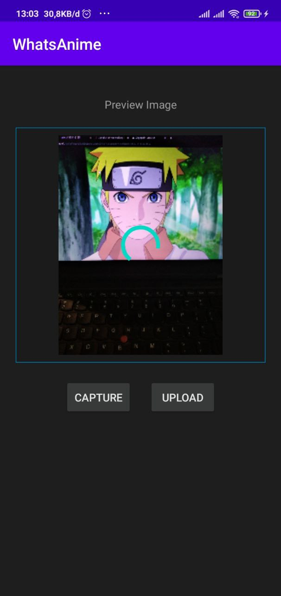

# Learn Android Kotlin
My learning repository of develop simple kotlin app

1. Always Hungry 
    
   AlwaysHungry Is app that provide image of food that get from https://foodish-api.herokuapp.com/api/ 
   What i learned ?  
   - Implement mvvm
   - Using Piccaso
     

2. Whats Anime 
    
   Is app for scanning anime image and get detail of the anime using api from https://trace.moe/api/search 
   What i learned ?  
   - Implement mvvm
   - Using Camera and Permission
